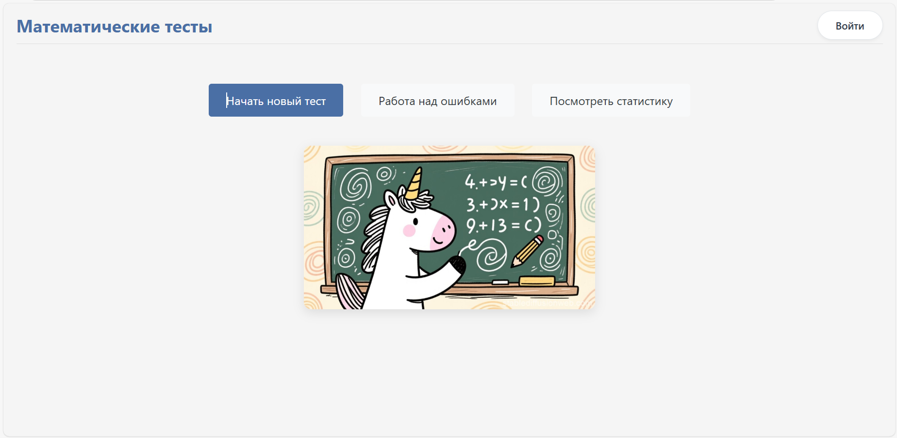
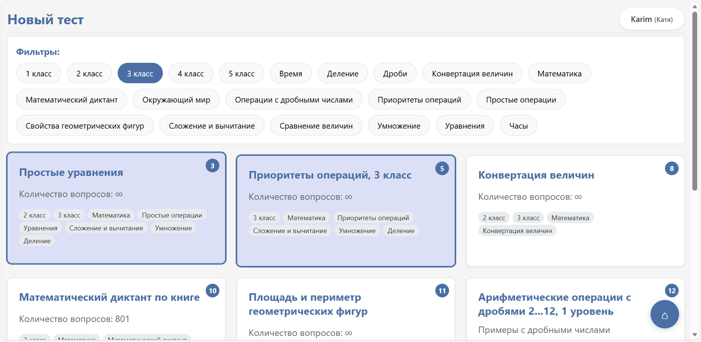
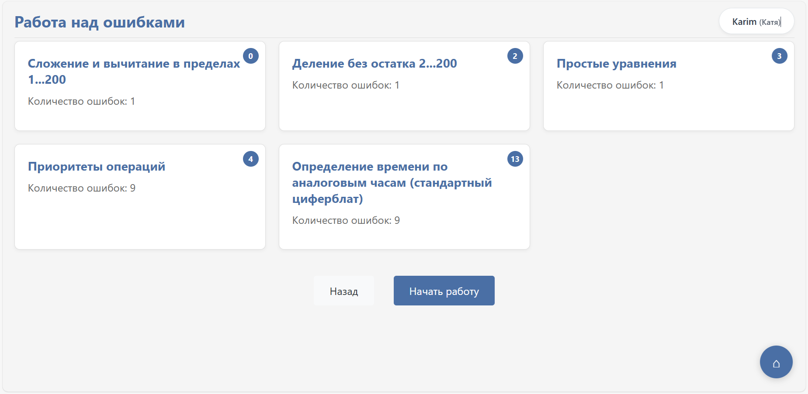
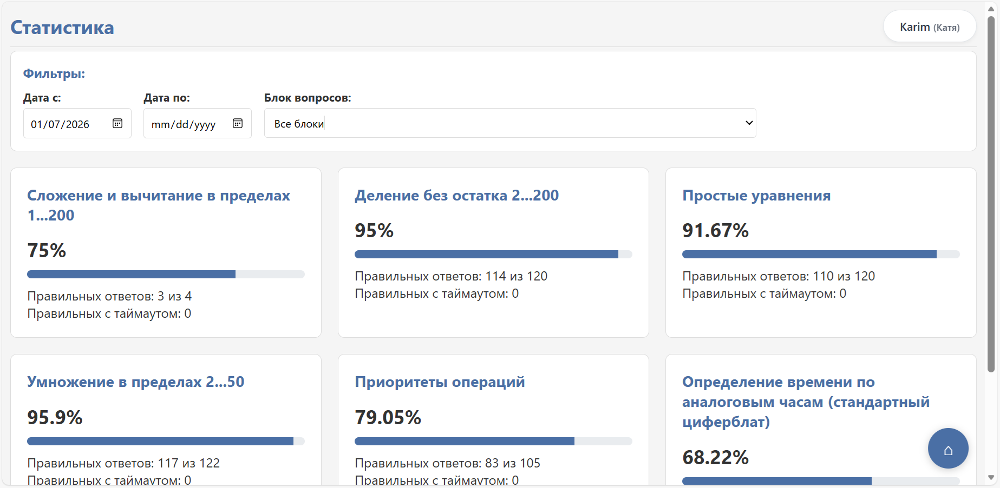
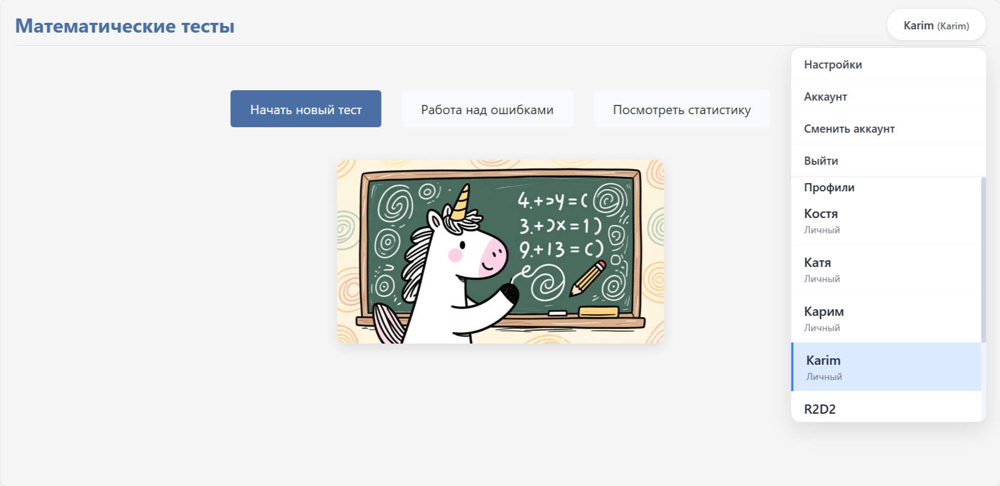
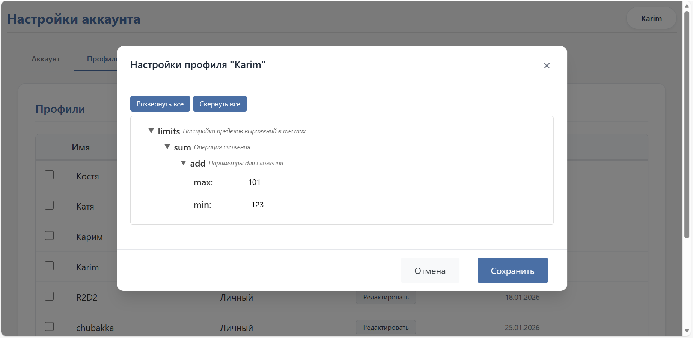
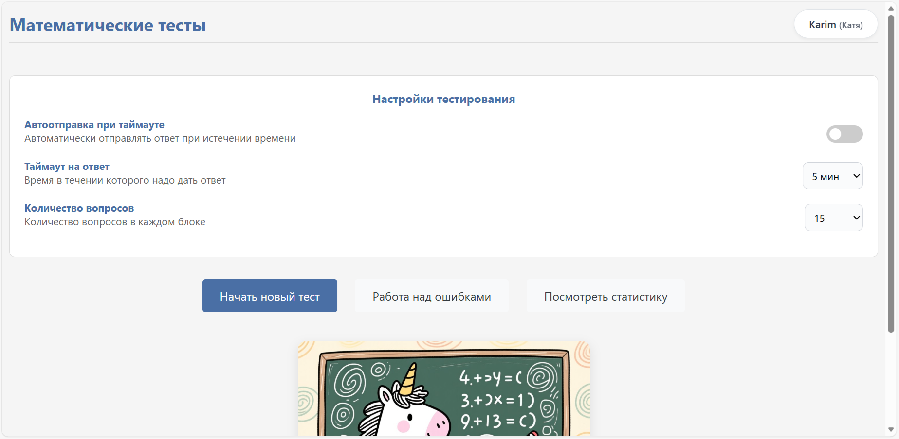
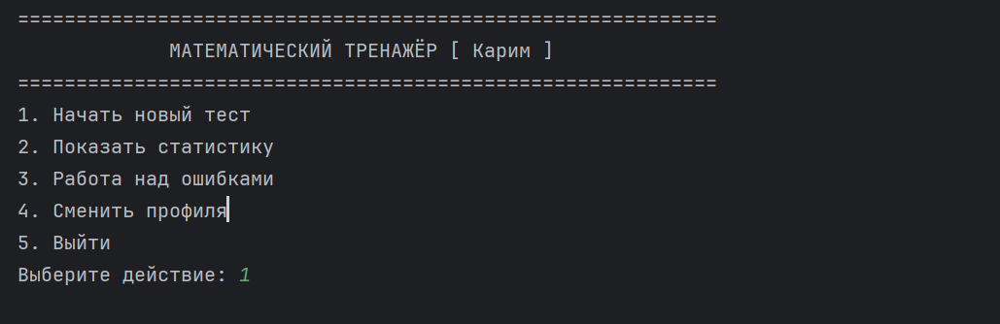

# Math test generator for age 7-11

*[Русская версия](README_RU.md)*

## Назначение
Это приложение было создано, чтобы помочь моим детям практиковаться и осваивать основы математики.
Оно предоставляет настраиваемые, автоматически генерируемые задания начиная с самых базовых операций.
Уровень заданий постепенно усложняется по мере роста прогресса в обучении. 
Хотя большинство задач генерируются автоматически, приложение также включает набор предопределённых вопросов.

## Цели
* Для учеников: Развитие математических навыков и умения эффективно работать в условиях ограниченного времени.
* Для родителей: Возможность отслеживать прогресс и успехи своего ребёнка с помощью истории и статистики.
* Для учителей: Создание индивидуальных заданий и мониторинг их выполнения и усвоения учениками. (В планах)

## Функции
* Автогенерация заданий по разделам
* Тесты описанные в формате YAML
* Веб-интерфейс
* Консольный интерфейс
* Контроль времени выполнения задания
* Настройка условий прохождения теста
* Функционал для анонимных пользователей и зарегистрированных пользователей
* Поддержка сессий с возможностью прерывания и возобновления теста
* История тестирования
* Работа над ошибками
* Статистика тестирования

## Перед первым запуском
Установка зависимостей
```bash
pip install -r requirements.txt
```
## Старт
Запуск веб-сервера
```bash
python math_test.py --server
```
Запуск консольного приложения
```bash
python math_test.py --console
```

## UI
По умолчанию веб-страница будет доступна по адресу http://localhost:5000
### Web страница







### Настройки
#### Управление профилями
Для создания нового профиля надо перейти через меню на страницу аккаунта и создать новый профиль.

Далее можно настроить лимиты, либо сразу при создании профиля, либо позже через редактирование профиля.
Если лимиты не заданы, будут использоваться дефолтные.

#### Настройки параметров теста
На главной странице в меню кликнуть пункт "Настройки", откроется панель:


### Консоль
Большая часть функционала тестов доступна в консоли (за исключением требующих html разметки). 


## Участие в разработке
Мы приветствуем вклад и идеи по расширению функциональности этого проекта!
Будь то исправление ошибки, добавление новой функции, улучшение документации или предложение нового типа математического задания.
Вы можете:
* Сделать форк репозитория.
* Создать ветку для ваших изменений.
* Отправить Pull Request с понятным описанием ваших улучшений.
Если у вас есть вопросы или вы хотите обсудить возможную новую функцию, пожалуйста, откройте Issue на GitHub.
Давайте сделаем изучение математики более увлекательным вместе!

## Лицензия
Этот проект распространяется под лицензией MIT.
Вы можете свободно использовать, изменять и распространять программное обеспечение в соответствии с условиями лицензии MIT.
Подробнее см. в файле *[LICENSE](LICENSE)* в репозитории проекта.


